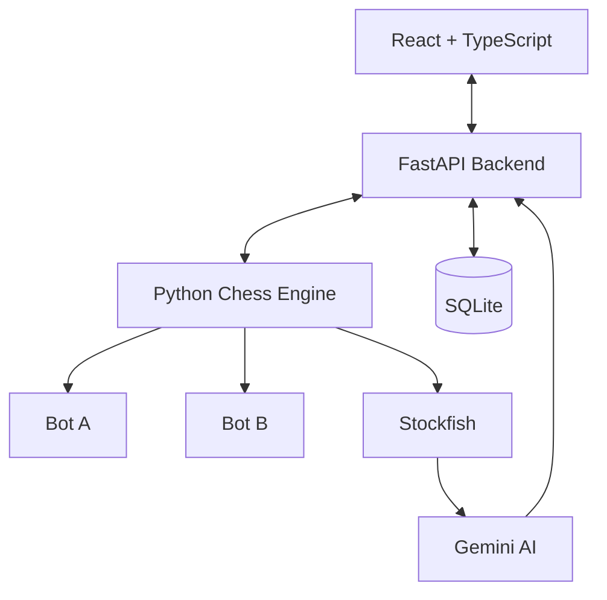

# Architecture

This document describes the high-level architecture of the AI Chess Bot Arena.

## Overview

The platform is designed to provide a seamless environment where autonomous Python chess bots can compete, while offering real-time visualization and deep AI-powered analytics.

## Frontend (React + TypeScript)
- Built with Vite, React, and TypeScript.
- Communicates with the FastAPI backend via REST and WebSockets.
- Renders the chessboard dynamically for live matches and replays.
- Displays the analytics dashboard and tournament brackets.

## Backend (FastAPI)
- Exposes RESTful endpoints for bot registration, tournament management, and historical data.
- Exposes WebSocket endpoints for streaming live game updates.
- Manages the SQLite database containing matches, tournaments, and insights.
- Integrates with the `Engine/` module to orchestrate games.

## Chess Engine (`Engine/`)
- Uses the `chess` Python library to manage board state and enforce legal moves.
- Spawns bot processes and communicates via inter-process communication (IPC) to execute moves within time limits.
- **Stockfish**: Run in the background to evaluate the objective centipawn score of board positions and flag blunders.
- **Gemini AI**: Invoked via the `google-genai` SDK to generate human-readable commentary when Stockfish detects massive evaluation swings.

## Tournament System
- A knockout-based structure.
- Registers bots, seeds them randomly or by rank, and orchestrates matches through the `TournamentManager`.
- Advances winners through the bracket until a champion is crowned.
